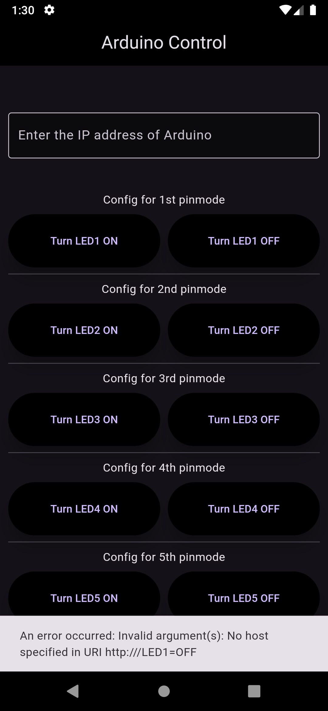
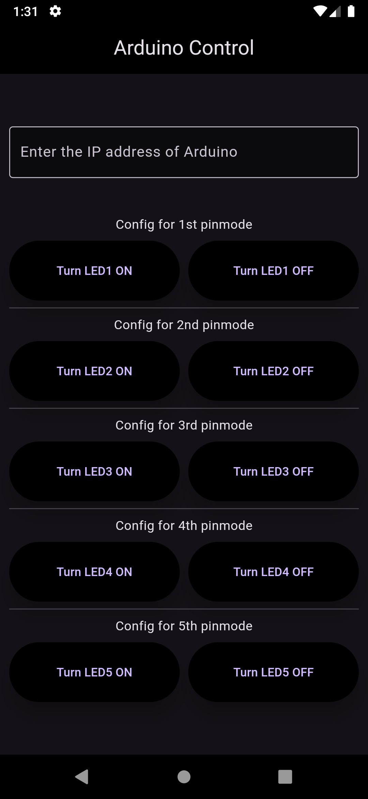
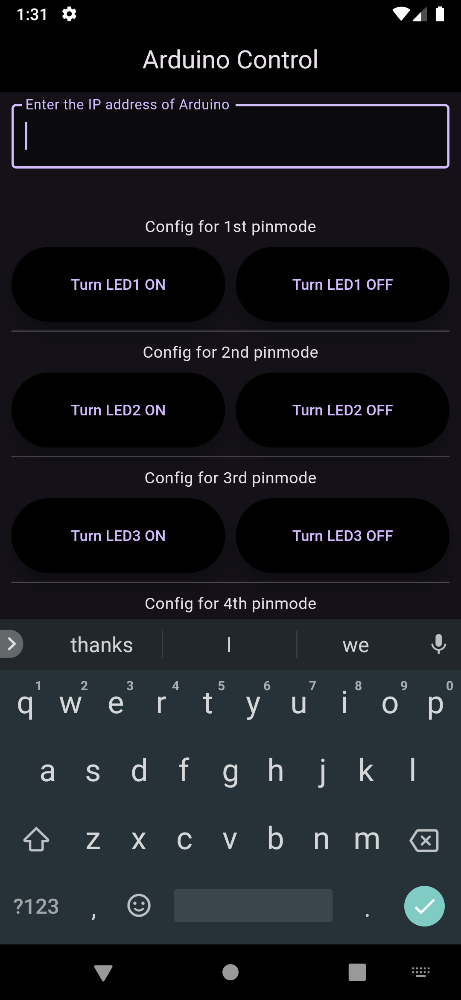

# Arduino Light Controller App

## Description
The Arduino Light Controller App is a simple application that allows users to control a light connected to an Arduino board over Wi-Fi. Users can turn the light on and off with a user-friendly interface, making it easy to manage lighting remotely.

## Configuration #Important
1. Ensure your Arduino is connected to the Wi-Fi network.
2. Update the IP address in the app to match your Arduino's IP.
3. Configure the relay module to the correct GPIO pin on the Arduino.

## Features
- **Wi-Fi Connectivity**: Control the light from anywhere within the Wi-Fi range.
- **On/Off Control**: Easily turn the light on or off with a single button.
- **User-Friendly Interface**: Simple and intuitive design for easy operation.
- **Real-Time Feedback**: Get immediate feedback on the current state of the light.

## Screenshots
|  |  |  |
|:---:|:---:|:---:|

## Installation

To install go to releases.\
see the [INFO.md](INFO.md) file for details & **change logs** .
