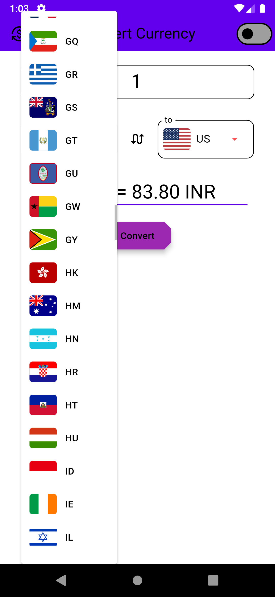
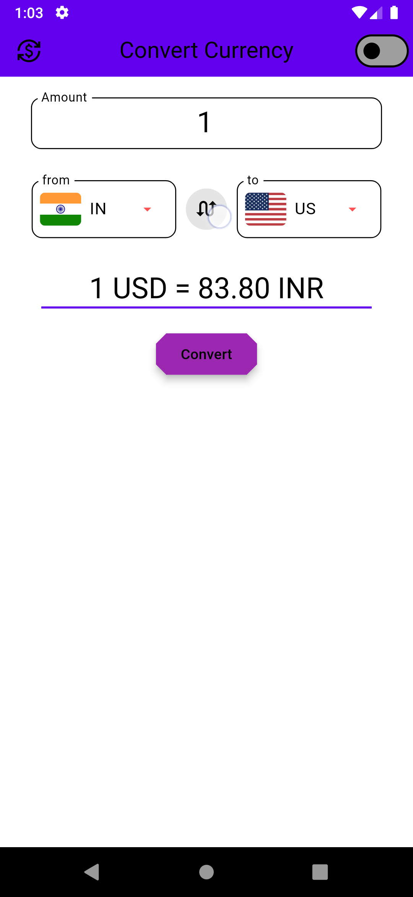
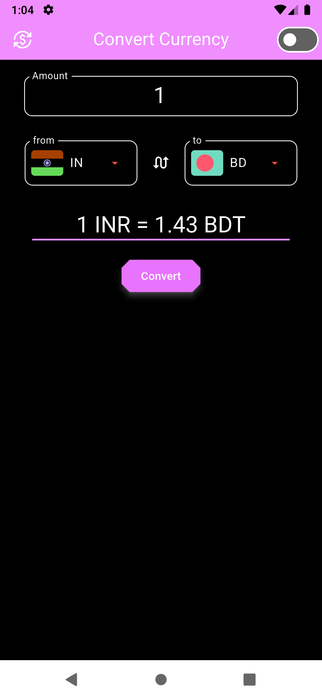

# Currency Converter App

## Description
The Currency Converter App is a straightforward application that allows users to convert amounts between different currencies. Users can select the source and target currencies, enter an amount, and receive the converted value in real-time.

## Features
- **Currency Selection**: Choose from a list of available currencies for conversion.
- **Real-Time Conversion**: Get up-to-date conversion rates and results instantly.
- **User-Friendly Interface**: Simple and intuitive design for easy navigation.
- **Swapping Button Support**: you can exchange between to-currency and from-currency 
- **Dark and Light theme**: you can change between themes based on system theme

## Screenshots
|  |  |  |
|:---:|:---:|:---:|

## Installation

To install go to releases.\
see the [INFO.md](INFO.md) file for details & **change logs** .
