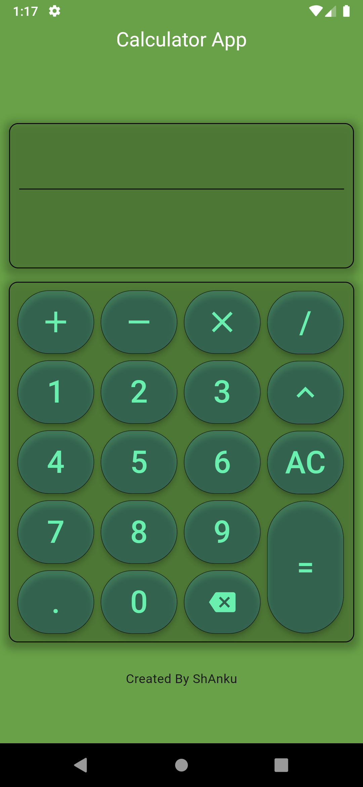
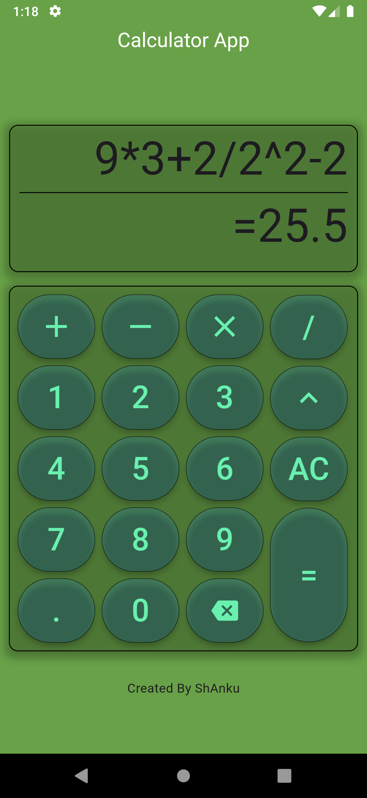
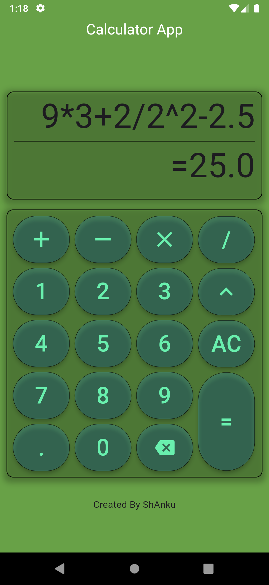

# Calculator App

## Description
The Calculator App is a simple and intuitive application that allows users to perform basic arithmetic operations such as addition, subtraction, multiplication, and division. The app features a user-friendly interface that makes calculations easy and efficient.

**this app works on _Data Structure_ Concepts
== _No calculator APIs uses_**
- Input String as Expression..
- Process string and **convert it to postfix**
- evaluate postfix string based on **operation precedance**

## Features
- **Basic Operations**: Perform addition, subtraction, multiplication, division, powers & decimal-point.
- **Clear Functionality**: Easily clear the current input or reset the calculator.
- **Green shadow Interface**: Simple layout for easy navigation and use.

## Screenshots
|  |  | | 
|:---:|:---:|:---:|

## Installation

To install go to releases.\
see the [INFO.md](INFO.md) file for details & **change logs** .
