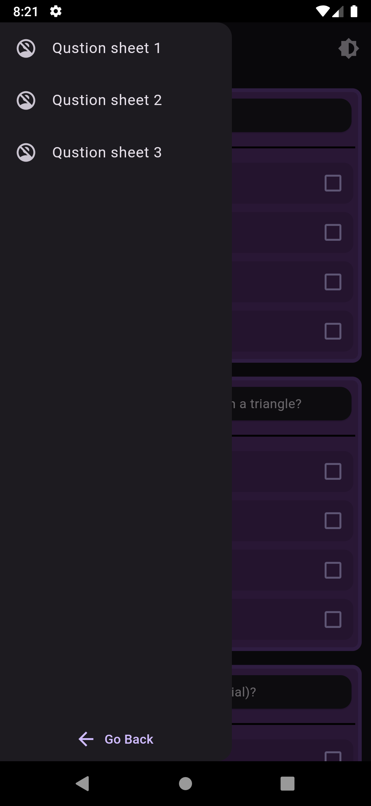
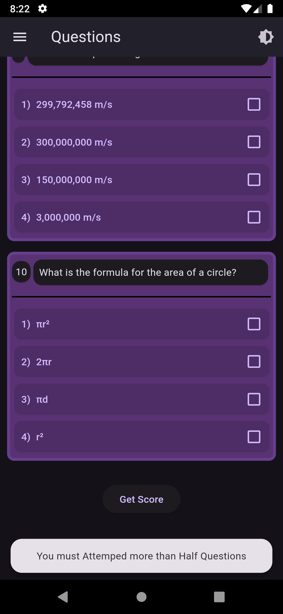
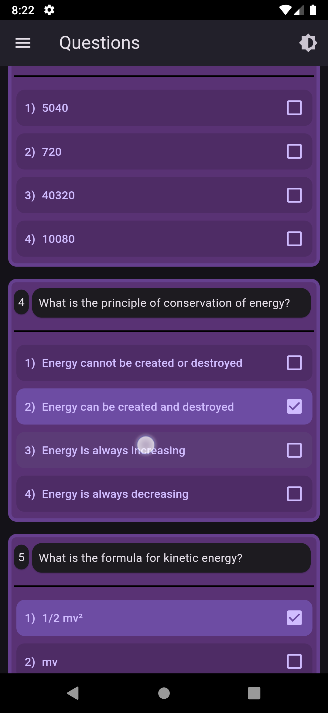
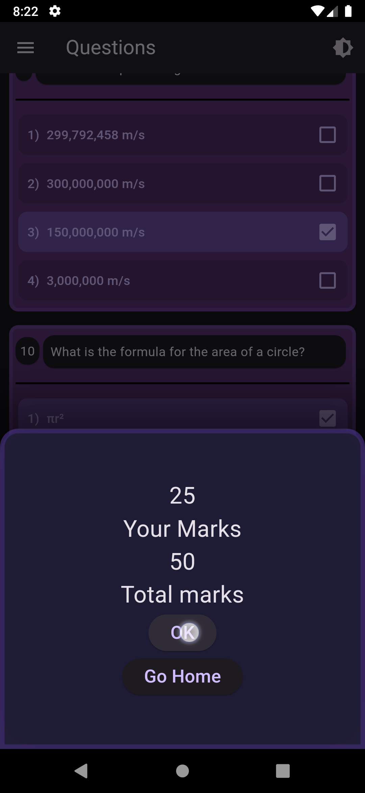

# Multiple Choice Question Answer App

## Description
The Multiple Choice Question Answer App is an interactive application designed to help users test their knowledge through multiple-choice questions. Users can answer a series of questions, receive immediate feedback, and evaluate their scores, making it an effective tool for learning and self-assessment.

## Features
- **Answer Multiple Choice Questions**: Users can select answers from a list of options for each question.
- **Score Evaluation**: At the end of the quiz, users receive a score based on their performance, along with a summary of correct and incorrect answers.
- **Track Progress**: Users can track their progress over time and improve their knowledge in various subjects.
- **Interactive Dark/Light Theme Support**: switching between theme by clicking the theme icon at top rignt corner, also follows system themeing.

## Screenshots

|  |  |  |
|:---:|:---:|:---:|
|  |  |  |
|:---:|:---:|:---:|
## Installation

To install, go to releases.\
See the [INFO.md](INFO.md) file for details & **change logs**.
