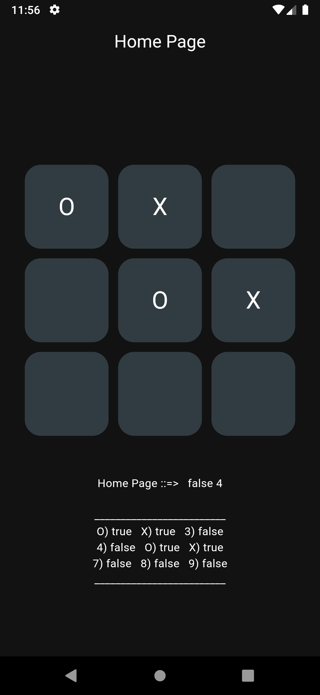
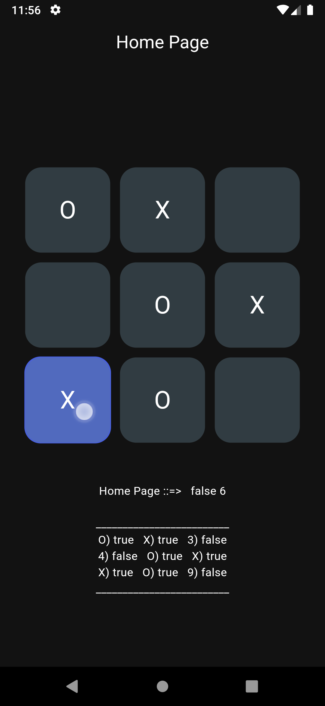
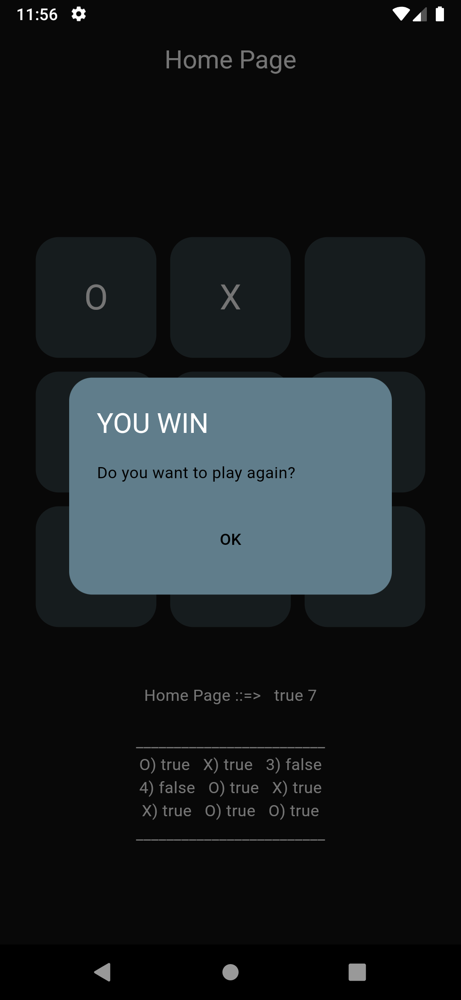

# Tic-Tac-Toe App

## Description
Tic-Tac-Toe is a classic two-player game where players take turns marking a square on a 3x3 grid. The first player to align three of their marks (either 'X' or 'O') horizontally, vertically, or diagonally wins the game. This app allows you to play Tic-Tac-Toe against another player or against an AI opponent.

## Features
- **Two Player Mode**: Play against a friend on the same device.
- **Reset Game**: Easily reset the game to start a new match.
- **Internal view**: you can view internal working matrix of the game
<!-- - **Single Player Mode**: Play against an AI opponent with adjustable difficulty. -->
<!-- - **Score Tracking**: Keep track of wins for both players. -->
<!-- - **Responsive Design**: Works on various screen sizes and orientations. -->

## Screenshots
 |  |  |
|:---:|:---:|:---:|

## Installation

To install go to releases.\
see the [RELEASE.md](RELEASE.md) file for details & **change logs** .

<!-- ## How to Play
1. Launch the app.
2. Choose the mode: Two Player.
3. Take turns placing your marks on the grid.
4. The first player to align three marks wins! -->
