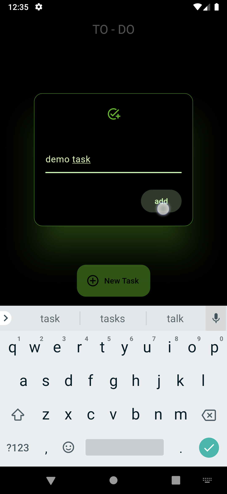
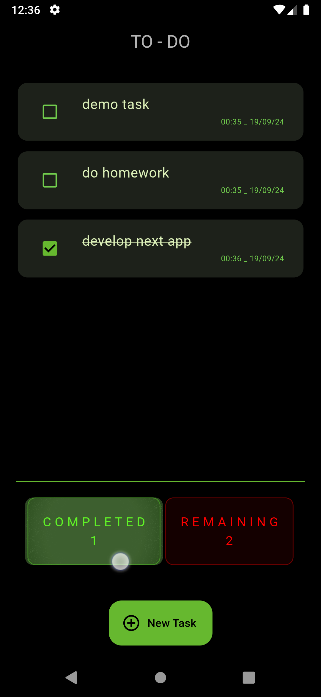
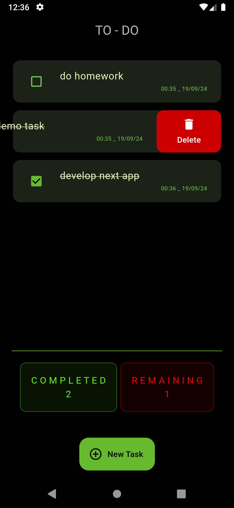

# To-Do App

## Description
The To-Do App is a simple and intuitive application that allows users to manage their tasks efficiently. Users can add, edit, delete, and mark tasks as complete, helping them stay organized and productive.

## Features
- **Add Tasks**: Easily add new tasks to your to-do list.
- **Edit Tasks**: Modify existing tasks to update their details.
- **Delete Tasks**: Remove tasks that are no longer needed.
- **Mark as Complete**: Check off tasks when they are done.
- **Filter Tasks**: View all tasks, completed tasks, or pending tasks.

## Screenshots
|  |  |  |
|:---:|:---:|:---:|

## Installation

To install go to releases.\
see the [INFO.md](INFO.md) file for details & **change logs** .
