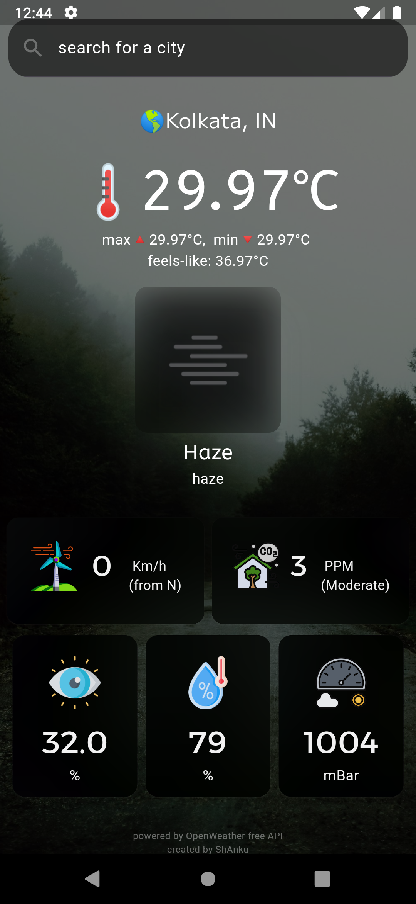
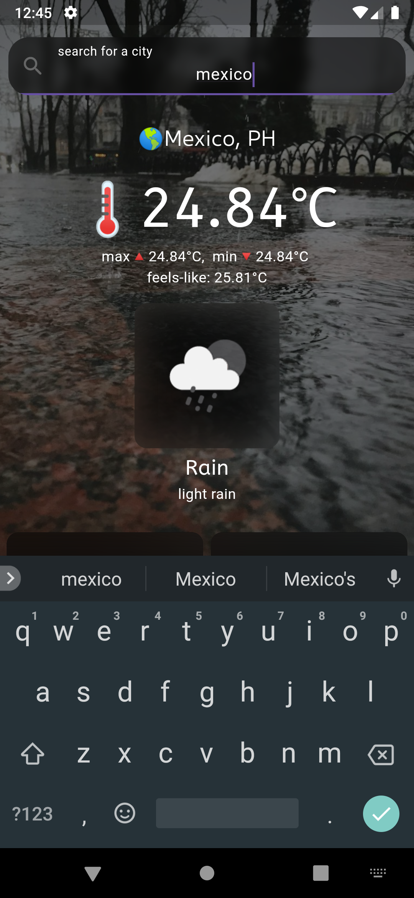
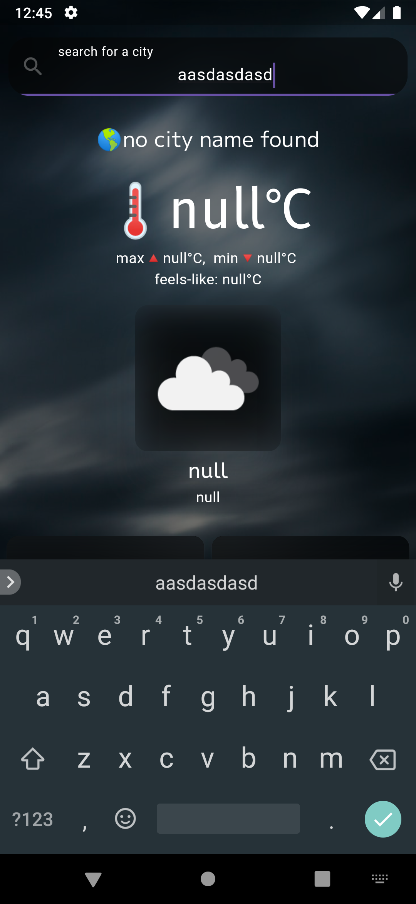

# Weather App

## Description
The Weather App is a simple application that allows users to search for current weather information by city. Users can enter the name of a city and receive real-time weather data, including temperature, humidity, and weather conditions.

## Features
- **Search by City**: Enter the name of any city to get its current weather information.
- **Display Weather Data**: View temperature, humidity, wind speed, and weather conditions, also including Air-Quality.
- **Responsive Design**: The app is designed to work on various screen sizes and devices.
- **User-Friendly Interface**: Simple and intuitive layout for easy navigation.

## Screenshots
|  |  | |
|:---:|:---:|:---:|

## Installation

To install go to releases.\
see the [INFO.md](INFO.md) file for details & **change logs** .
